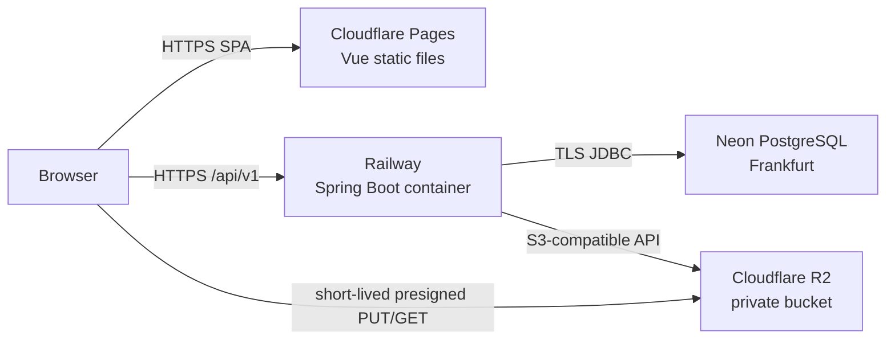
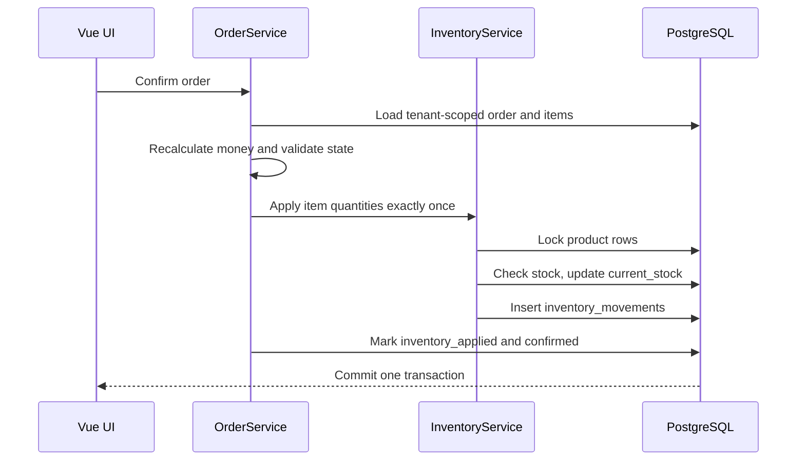

# 系统架构

## 目标与关键不变量

Inventory Art 是一个可部署的多租户模块化单体。设计优先级依次为数据隔离、库存/订单一致性、SumUp 导入幂等、可运维性和后续扩展能力。

以下规则贯穿所有模块：

- 普通用户的 `tenantId` 只来自认证上下文，不能来自请求体、查询参数或路径中的任意值。
- `InventoryService` 是 `products.current_stock` 的唯一业务写入口；每次变更与库存流水在同一事务提交。
- 订单金额由服务端根据明细、折扣、税和币种规则重算，不信任客户端提交的汇总金额。
- 上传和分析 SumUp 文件不修改订单或库存；只有带分析版本的显式确认才能产生业务数据。
- 业务历史不通过物理删除“修正”；订单取消、退款和导入撤销通过状态与反向流水表达。
- 不同币种不直接相加；报表按币种分组。
- 时间在数据库中使用 UTC `TIMESTAMPTZ`，展示和输入范围按 Tenant 时区解释。

## 运行时拓扑



生产后端无本地持久化依赖。数据库状态、业务元数据和对象 key 存入 Neon；图片与原始导入文件存入私有 R2。浏览器只接收单对象、单操作、短期有效的预签名 URL，不接收 R2 密钥。

本地 Compose 用 PostgreSQL 替代 Neon、MinIO 替代 R2，并运行相同后端接口和 Flyway migration。

## 后端模块

后端位于 `backend/src/main/java/com/inventoryart`，采用按业务能力分包的模块化单体。

| 模块 | 职责 |
| --- | --- |
| `auth` / `security` | 登录、JWT、Refresh Token 轮换、认证上下文、角色授权、登录限流 |
| `tenant` / `user` | Tenant、用户、个人设置、ADMIN 用户与 Tenant 管理 |
| `product` | 商品 CRUD、SKU 约束、图片关联、销售聚合视图 |
| `inventory` | 行锁/版本检查、库存变更、库存流水、批量调整和导出 |
| `order` / `payment` | 订单状态机、金额计算、支付、取消、退款和库存协调 |
| `sumup` | 文件上传、解析、映射、预览、幂等导入、外部交易和撤销 |
| `report` | 集中的数据源纳入策略、KPI、趋势和分组聚合 |
| `storage` | `StorageService` 以及 Local、MinIO、R2 实现，预签名和对象确认 |
| `audit` | 安全与业务关键操作审计，尤其是 ADMIN 跨 Tenant 访问 |
| `common` / `exception` / `config` | 分页、金额/时间、公用配置、traceId、统一错误响应 |

Controller 仅处理 HTTP、DTO 校验和认证入口；Service 负责事务与业务规则；Repository 负责 Tenant-aware 查询。JPA Entity 不直接作为 API 响应。

依赖方向保持为“HTTP/DTO → Service → Repository/Storage”，跨业务写操作由上层事务服务协调。报表只读取订单、交易和汇总，不反向依赖 Controller。

## 前端模块

前端位于 `frontend/src`：

```text
src/
├── api/          Axios 实例、Token 刷新队列和模块 API
├── components/   可复用表格、表单、状态和上传组件
├── layouts/      USER/ADMIN 共用管理布局
├── locales/      en、zh-CN、fr-FR，同构 key 集
├── router/       路由定义、认证和角色守卫
├── stores/       会话、用户设置和业务状态
├── types/        API DTO 与页面类型
├── utils/        金额、数字、日期、错误格式化
└── views/        登录、业务页面、管理员页面和错误页
```

Pinia 会话 Store 只在内存持有 Access Token。Axios 遇到可刷新认证错误时使用单一刷新队列，防止并发请求触发多次 Refresh Token 轮换。路由和菜单按角色改善体验，但后端始终是最终授权者。

## 关键数据流

### 登录与刷新

1. 登录端点校验“IP + 标准化用户名”频率、用户状态和 BCrypt 密码。
2. 服务端签发短期 JWT，并把随机 Refresh Token 作为 HttpOnly Cookie 返回；数据库只保存 SHA-256 哈希和令牌族信息。
3. 前端把 Access Token 保存在内存，并使用登录响应中的 `preferredLocale` 切换语言。
4. Access Token 过期后，刷新端点校验允许的 Origin、轮换 Refresh Token 并签发新 JWT。
5. 已轮换令牌被再次使用时，撤销其整个令牌族；退出也撤销当前令牌。

### 订单与库存



草稿不扣库存。重复确认通过订单状态和 `inventory_applied` 幂等保护。已确认订单编辑只应用新旧数量差；取消和有商品明细的退款生成恢复流水。外部退款若只有金额、没有商品数量，则不推测库存影响。

### 文件存储

1. API 根据当前 Tenant 和目标资源生成 `tenants/{tenantId}/.../{uuid}.{ext}` key，并创建待确认 `stored_files` 记录。
2. 浏览器用预签名 PUT 直传 MinIO/R2。
3. 客户端通知后端确认；后端通过 HEAD 校验内容类型、大小和 checksum，再绑定业务资源。
4. 下载使用短期预签名 GET；删除为受权操作并写审计。未确认对象由清理任务回收。

SumUp 导入文件也可由服务端流式上传到 StorageService，以便同步计算 SHA-256 和清理敏感数据边界。

### SumUp 导入

导入是一个以 `import_batches.status` 和 `analysis_version` 驱动的持久化工作流：

```text
UPLOADED → ANALYZING → READY_FOR_MAPPING → READY_FOR_CONFIRMATION
         → IMPORTING → COMPLETED / COMPLETED_WITH_ERRORS
                                  ↘ FAILED
COMPLETED / COMPLETED_WITH_ERRORS → REVERSED
```

解析结果每 200 行写入 `import_rows` 并清理持久化上下文，不把整个源文件保存在内存。正式确认在一个数据库事务中完成，使用 20,000 行硬上限控制内存和事务时长；唯一约束、外部交易 ID/fingerprint 和行状态使失败后的整批重试保持幂等。完整规则见 [sumup-import.md](sumup-import.md)。

### 报表

`ReportSourcePolicy` 先决定记录是否纳入，再执行聚合：

- 与手动订单关联的外部交易只计算订单。
- SumUp 导入生成的订单只计算订单一次。
- 商品销售汇总和会计汇总用于对账，不与逐笔数据同时进入主销售额。
- 未分配交易可进入财务销售额，但不能进入具体商品销量。

商品累计销售数据通过聚合查询返回，不反写 `products`。

## i18n 与区域设置

- UI 支持 `en`、`zh-CN`、`fr-FR`；英文是源语言和 fallback。
- 未登录启动和新用户首次登录默认英文，不根据浏览器语言自动推断。
- `users.preferred_locale` 保存 UI 偏好；登录、刷新会话和 `/api/v1/profile` 返回该值。
- `tenants.locale` 是业务区域默认值，不能覆盖用户 UI 语言。
- Element Plus locale、Vue I18n、`Intl.NumberFormat` 和 `Intl.DateTimeFormat` 同步切换；币种和时区仍来自 Tenant。

## API 与错误边界

- 公共前缀：`/api/v1`；ADMIN 使用独立 `/api/v1/admin/**` 路径。
- 普通分页结构：`{items,page,size,totalElements,totalPages,sort}`。
- 错误结构：`timestamp`、`status`、稳定业务 `code`、本地化 `message`、`path`、可选 `fieldErrors`、`traceId`。
- 资源不属于当前 Tenant 时，普通用户得到 `404 RESOURCE_NOT_FOUND`，不泄露资源是否存在。
- 未处理异常只返回通用错误和 traceId；堆栈仅写服务端日志且必须过滤敏感值。

## 扩展边界

当前架构保留但不提前实现以下扩展：一个 Tenant 多成员、套餐/订阅、汇率服务、独立任务 Worker、SumUp API provider 和更细粒度角色。拆分服务前应优先通过模块边界、索引、批处理和后台任务扩展单体；只有独立扩缩容或故障域产生实际需求时才拆分。
