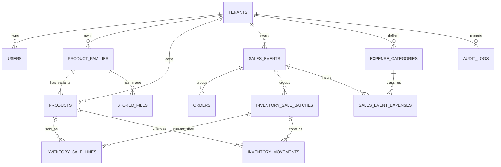

# 数据库结构

PostgreSQL 结构由 Flyway 管理。V1 至 V10 保留历史；V11 至 V13 以前向迁移把商品公共资料、库存规格和图片归属分层。

## 关系概览

## 当前表

| 表                       | 用途                        | 关键约束                          |
| ------------------------ | --------------------------- | --------------------------------- |
| `tenants`                | 工作空间、默认币种和时区    | slug 唯一                         |
| `users`                  | 登录账号与角色              | username 唯一，归属 Tenant        |
| `refresh_tokens`         | Refresh Token 轮换和撤销    | 令牌哈希唯一                      |
| `product_families`       | 作品公共资料与共享图片      | Tenant 复合外键、乐观锁版本       |
| `products`               | 可独立计数的商品规格与库存  | Tenant 内 SKU 唯一、系列外键非空  |
| `sales_events`           | 展会名称、日期范围和状态    | 结束日不早于开始日                |
| `orders`                 | 展会小时金额记录            | 展会非空，金额大于零              |
| `inventory_sale_batches` | 一次商品销量登记的批次头    | `ACTIVE/CANCELLED`、乐观锁版本    |
| `inventory_sale_lines`   | 售出批次的当前有效商品明细  | Tenant 内批次与商品唯一           |
| `inventory_movements`    | 不可变商品库存流水          | 数量变化非零，保留售出更正与冲销  |
| `expense_categories`     | Tenant 共享的自定义支出类别 | Tenant 内名称大小写不敏感唯一     |
| `sales_event_expenses`   | 展会支出及币种历史快照      | 正数金额、`ACTIVE/VOIDED`、乐观锁 |
| `stored_files`           | 系列共享图片对象元数据      | 商品系列外键非空                  |
| `audit_logs`             | 关键写操作审计              | 保存 Tenant、操作人、实体和摘要   |

## 核心字段

`orders` 只保存：主键、Tenant、系统订单号、展会、币种、总金额、销售小时、录入人、版本和时间戳。币种是 Tenant 默认币种的历史快照。

`inventory_sale_lines` 是售出批次的当前业务状态。`inventory_movements` 保存商品、流水类型、数量变化、变更前后库存、销量批次、备注、操作人和时间戳；`SALE_CORRECTION` 与 `SALE_REVERSAL` 只用于不可变追踪，不直接进入业务列表和报表。

`sales_event_expenses` 保存展会、类别、正数金额、创建时币种、实际支出日、备注、状态和操作人。支出作废不物理删除。报表按关联展会的结束日归属支出。

`product_families` 保存作品名称、分类、画师、描述和共享图片；`products` 保存规格名称、SKU、库存、低库存阈值和启用状态。库存流水与销量明细继续引用稳定的 `products.id`。

`stored_files` 专用于商品图片，保存系列外键、原图与低清预览各自的对象 key、MIME、大小、checksum，以及文件名和时间戳。

## V8 清理

V8 删除了不适用于当前业务的数据结构，包括旧订单商品明细、收款、退款、文件导入和外部交易表，以及订单上的来源、状态、渠道、客户、折扣、税费和导入字段。

迁移不会伪造展会归属。若旧核心交易或销量批次没有展会，迁移会明确失败，要求在升级前先处理该环境中的异常数据。

## V10 售出与支出

V10 为现有售出批次增加状态、更新时间、操作人和版本，并从原有 `SALE` 流水按 Tenant、批次和商品聚合回填当前售出明细。回填不修改商品库存，也不删除原始流水。迁移同时创建支出类别与展会支出表，所有资源关系使用包含 `tenant_id` 的复合外键。

## V11 至 V13 商品系列

V11 为每个旧商品创建同 ID 的单规格系列并回填图片归属，不改变商品 ID、SKU、库存或历史关联；V12 完成新旧应用切换窗口；V13 在确认所有关系均已回填后，将系列和文件外键设为非空，并删除商品行中重复的公共资料、售价、成本、商品币种及旧文件商品外键。旧商品的规格名保持为空，展示时仍使用原商品名。

## 一致性规则

- 所有业务外键都必须指向同一 Tenant 的记录。
- 订单日期是否属于展会范围由服务层按 Tenant 时区验证。
- 商品扣库在事务内完成，库存不足时不写入任何批次或流水。
- 售出更正和撤销按商品 ID 固定顺序锁定；版本冲突或任一商品库存不足时整批回滚。
- 金额与商品数量是独立事实，不建立订单与商品的关联。
- Hibernate 配置为 `ddl-auto=validate`，禁止由 ORM 自动修改生产结构。

## 迁移开发

已有迁移不可改写。新增结构变更必须创建下一条前向迁移，并通过集成测试验证空库依次执行全部迁移后的最终表、列、索引与外键。
