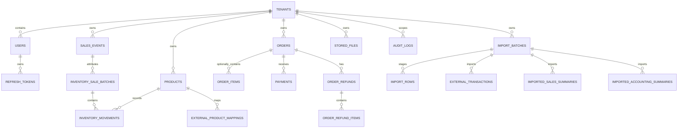

# 数据库结构

## 约定

- 数据库为标准 PostgreSQL；生产使用 Neon，但 migration 不依赖 Neon 专有功能。
- 主键统一为应用生成的 UUID，避免依赖单节点 sequence，并便于在写入前生成对象 key/关联 ID。
- 时间点使用 `TIMESTAMPTZ` 并以 UTC 写入；仅会计自然日使用 `DATE`。
- 金额使用 `NUMERIC(19,4)`，Java 使用 `BigDecimal`。API 输出前按 ISO 4217 币种小数位和 `HALF_UP` 规则处理。
- 原始外部数据使用 `JSONB`，但写入前必须移除完整卡号、CVV、Token 和其他不需要的敏感字段。
- 所有可修改实体包含 `updated_at`；不可变事件至少包含 `created_at`。
- Flyway 是唯一生产建表机制；Hibernate 使用 `ddl-auto=validate`，不得自动更新生产 schema。

## 关系总览



所有业务父子关系同时携带 `tenant_id`。例如 `order_items(tenant_id, order_id)` 引用 `orders(tenant_id, id)`，防止一个 Tenant 的子记录关联另一个 Tenant 的父记录。

## 表目录

### 身份与 Tenant

| 表               | 目的与关键字段                                               | 关键约束                                                                                          |
| ---------------- | ------------------------------------------------------------ | ------------------------------------------------------------------------------------------------- |
| `tenants`        | 工作空间；名称、slug、默认币种、时区、业务 locale、启用状态  | `slug` 全局唯一；默认 EUR / Europe/Paris；`locale` 不等同于 UI 语言                               |
| `users`          | 登录身份；可选 Tenant、用户名、邮箱、密码哈希、角色、UI 语言 | 用户名/邮箱全局唯一；USER 必须有 Tenant；`preferred_locale IN ('en','zh-CN','fr-FR')` 且默认 `en` |
| `refresh_tokens` | Refresh Token 哈希、令牌族、轮换和撤销状态                   | `token_hash` 唯一；按 `(user_id,family_id)` 索引；不保存明文 Token                                |

ADMIN 的 `users.tenant_id` 可以为空；普通 USER 必须非空。`refresh_tokens` 不重复存 `tenant_id`，其安全范围通过不可变的 `user_id` 外键解析。

### 商品与库存

| 表                       | 目的与关键字段                                                   | 关键约束/索引                                                                                |
| ------------------------ | ---------------------------------------------------------------- | -------------------------------------------------------------------------------------------- |
| `products`               | 商品资料、售价/成本、当前库存、低库存阈值、乐观锁版本            | `UNIQUE(tenant_id,sku)`；`current_stock >= 0`；Tenant + enabled + name 索引                  |
| `sales_events`           | 展会名称、开始/结束日期和启用状态                                | Tenant 内名称唯一；`end_date >= start_date`；Tenant + end_date 索引                          |
| `inventory_sale_batches` | 渠道、展会 ID/名称快照、币种、分析归属日、备注和操作人           | 展会使用 Tenant 组合外键；按日期/渠道/展会索引                                               |
| `inventory_movements`    | 每次独立库存调整的前后值、类型、数量、售出批次、实际单价和操作人 | `stock_after >= 0`、`unit_price >= 0`；Tenant + product/operator/date 索引；记录不可物理删除 |

`products.current_stock` 是便于读取的当前快照，`inventory_movements` 是审计来源。售出批次先写 `inventory_sale_batches`，再为每个商品写负向 `SALE` 流水；同一事务中任一库存不足会回滚全部记录。展会批次的 `attributed_date` 固定为 `sales_events.end_date`，线上/其他渠道使用提交时 Tenant 本地日期。

### 订单、支付和退款

| 表                   | 目的与关键字段                                                             | 关键约束/索引                                                                     |
| -------------------- | -------------------------------------------------------------------------- | --------------------------------------------------------------------------------- |
| `orders`             | 订单号、来源、状态、分配状态、展会、渠道、录入人、客户快照、必填金额和币种 | `UNIQUE(tenant_id,order_number)`；Tenant + 渠道/录入人/日期索引；`version` 乐观锁 |
| `order_items`        | 商品关联与 SKU/名称快照、单价、数量、税/折扣/行总额、已退款数量            | Tenant 组合外键到订单和商品；`quantity > 0`                                       |
| `payments`           | 订单支付、provider 交易号、金额、币种、方式和状态                          | Tenant 组合外键到订单                                                             |
| `order_refunds`      | 订单级退款金额、原因和操作人                                               | Tenant 组合外键到订单；保留历史                                                   |
| `order_refund_items` | 部分/全额退款对应的订单项、数量和金额                                      | Tenant 组合外键到退款和订单项；`quantity > 0`                                     |

订单可以没有 `order_items`。有商品时会保留名称和 SKU 快照，因此商品之后改名不会改变历史单据。`inventory_applied` 与库存流水中的订单/导入关联列仅为兼容历史数据保留；新订单和新导入始终不应用库存。`manually_modified_after_import` 用于判断导入能否自动撤销。

### SumUp 与外部销售

| 表                              | 目的与关键字段                                                   | 关键约束/索引                                                                              |
| ------------------------------- | ---------------------------------------------------------------- | ------------------------------------------------------------------------------------------ |
| `import_batches`                | 文件、checksum、类型、展会 ID/名称快照、分析版本、状态和汇总计数 | `UNIQUE(tenant_id,source_provider,file_checksum)`；Tenant + status/event + created_at 索引 |
| `import_rows`                   | 分批持久化的标准化行、已清理原始数据、错误、关联订单/商品        | `UNIQUE(tenant_id,import_batch_id,row_number)`；批次 + 状态索引                            |
| `import_column_mappings`        | 此批次源列到规范字段的映射                                       | `UNIQUE(tenant_id,import_batch_id,source_column)`                                          |
| `external_transactions`         | SumUp 交易状态、金额、费用、支付信息、fingerprint、清理后的 JSON | 非空 provider ID 的部分唯一索引；Tenant + provider + fingerprint 唯一                      |
| `external_product_mappings`     | 外部商品名/reference 到内部商品的 Tenant 私有映射                | `UNIQUE(tenant_id,provider,normalized_external_name)`                                      |
| `imported_sales_summaries`      | 产品/周期销售汇总，只用于对账，不应用库存                        | Tenant 组合外键到批次和商品                                                                |
| `imported_accounting_summaries` | 日期/支付方式/税率汇总，用于会计对账                             | Tenant 组合外键到批次；不生成订单或库存                                                    |

`external_transactions` 的两层幂等键：

```text
(tenant_id, provider, provider_transaction_id) WHERE provider_transaction_id IS NOT NULL
(tenant_id, provider, fingerprint)
```

同一外部编号可以出现在不同 Tenant；同一 Tenant 内不能重复产生销售。导入状态机和完整规则见 [sumup-import.md](sumup-import.md)。

### 文件与审计

| 表             | 目的与关键字段                                                          | 关键约束/索引                                                            |
| -------------- | ----------------------------------------------------------------------- | ------------------------------------------------------------------------ |
| `stored_files` | 对象 key、原文件名、类型、大小、checksum、用途、确认/删除状态和资源关联 | `object_key` 全局唯一；Tenant + resource 索引；对象内容不进入 PostgreSQL |
| `audit_logs`   | actor、角色、动作、资源、结果、IP、User-Agent、清理后 metadata          | Tenant + 日期、actor + 日期索引；ADMIN 全局动作允许 Tenant 为空          |

数据库只保存对象 metadata。`stored_files.status`、`confirmed_at` 和 `deleted_at` 支持临时上传确认、软删除与清理；Bucket 默认私有。

## Tenant 隔离约束

数据库约束是应用层授权的第二道防线：

1. 所有业务根表有非空 `tenant_id` 外键。
2. 被子表引用的根表提供 `UNIQUE(tenant_id,id)` 候选键。
3. 子表使用 `(tenant_id,parent_id)` 组合外键，不允许跨 Tenant 关联。
4. 唯一业务标识均以 Tenant 开头，例如 SKU、订单号、外部交易和文件 checksum。
5. 高频查询索引以 `tenant_id` 为首列，避免全局扫描并降低错误查询的影响面。

数据库不替代授权：Repository 仍必须显式带 Tenant 条件；普通用户不能先 `findById` 再在内存比较 Tenant。当前 MVP 不启用 PostgreSQL Row-Level Security，原因和测试要求见 [security-and-tenancy.md](security-and-tenancy.md)。

## 金额、币种和时间

- 每个金额列都和同一记录的 ISO 4217 `currency` 一起解释。
- 订单总额由请求显式提供且必须为正数；库存售出归因金额为 `abs(quantity) × unit_price`，只用于商品/渠道/定价分析，不覆盖或累加到订单总额。
- 报表按币种分组，禁止在 SQL 中把不同币种直接 `SUM` 成一个值。
- 用户提交的本地日期范围先使用 Tenant `timezone` 转为半开 UTC 区间 `[start,end)`，再查询 `TIMESTAMPTZ`。
- `tenants.locale` 用于业务区域默认值；`users.preferred_locale` 控制 UI 文案，默认英文。

## 状态与历史策略

- 订单、支付、导入和文件使用明确字符串枚举，并由应用服务验证允许的状态迁移。
- 库存流水、退款、导入行和审计日志是历史记录，不物理删除。
- 撤销导入不会删除原批次；它将批次置为 `REVERSED`，并失效可安全失效的订单和外部交易，不触碰库存。
- 所有导入 JSON 只保留排错/重处理需要的字段；完整银行卡号、CVV、认证信息不得写入 JSONB。

## Migration 规则

1. 新 schema 变更添加新的、只向前执行的 `V{n}__description.sql`；已部署的 migration 不得修改。
2. 先添加可空列/兼容代码，再回填和加约束，避免一次发布破坏现有数据。
3. 大表索引和回填在发布前用生产规模副本验证锁时长。
4. CI 和应用启动都执行 Flyway 校验；生产应用账号必须具备 migration 所需权限，或使用单独的受控迁移步骤。
5. 回滚优先回滚应用版本；数据库采用前向修复 migration，不能依赖破坏性自动降级。

## 常用一致性检查

运维排错时可以在只读事务中验证：

- 商品 `current_stock` 是否与该商品最后一条流水 `stock_after` 一致。
- 新创建订单和导入批次是否保持零库存流水。
- `import_batches` 的各行计数是否等于 `import_rows` 状态聚合。
- active external transaction 是否只关联同 Tenant 的订单。
- 已确认 `stored_files` 是否能在对象存储中 HEAD 到，未确认文件是否超过清理期限。

任何修复都必须通过业务 Service 或受审计的管理员修复流程执行，不能直接删除历史行。
