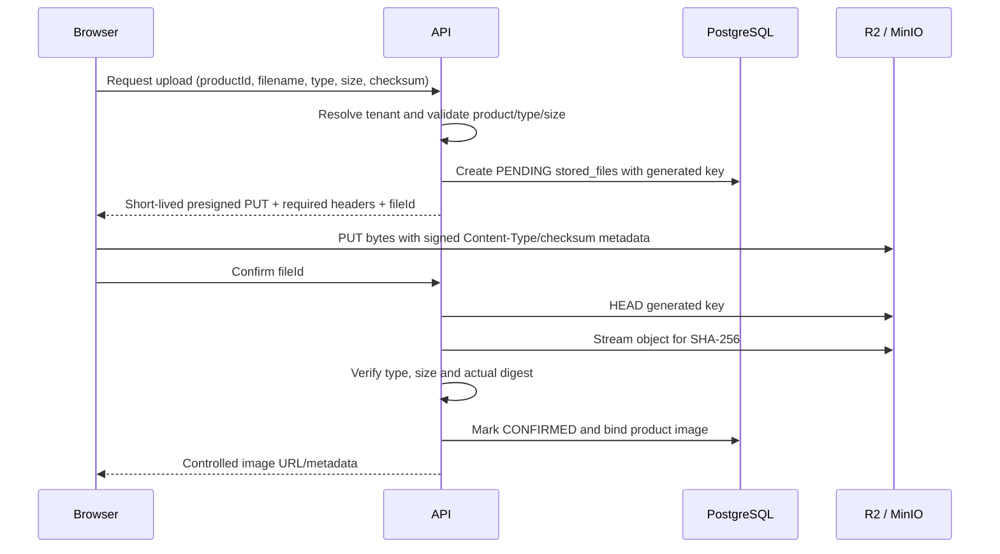

# Cloudflare R2 与对象存储

## 设计原则

- PostgreSQL 只保存 object key、类型、大小、checksum、状态和资源关联，不保存 Base64 或二进制文件。
- 生产 Bucket 私有，不开放匿名列举；商品图片和 SumUp 原文件都通过授权后的短期 URL 访问。
- R2 使用 S3-compatible API。项目引入 AWS SDK for Java v2 只是客户端库，不部署或依赖任何 AWS 服务。
- object key 由后端根据当前认证 Tenant 生成；客户端文件名永远不能决定目录或覆盖目标。
- 浏览器只接收单对象、单操作、短期有效的预签名 URL，永远不接收 R2 Access Key/Secret。

## StorageService 边界

各环境使用同一业务接口：

```text
StorageService
├── LocalStorageService          本机开发/测试
└── S3CompatibleStorageService   Docker Compose MinIO / 生产 R2
```

接口能力包括：

- 为 PUT/GET 生成短期预签名操作；
- 服务端流式 `put`（适合 SumUp 原文件，同时计算 checksum）；
- `head` 读取 content type、大小、checksum/metadata；
- 受控下载；
- 删除对象；
- 所有 provider 把“未找到”“签名失败”“存储不可用”映射为稳定领域错误。

Service/Controller 只能依赖 `StorageService`，不能直接构造 R2 SDK client。

## Object key 规则

推荐且固定的 key 形状：

```text
tenants/{tenantId}/products/{productId}/{uuid}.{ext}
tenants/{tenantId}/imports/sumup/{batchId}/{uuid}.{ext}
tenants/{tenantId}/temporary/{purpose}/{uuid}.{ext}
```

- `tenantId`、资源 ID 和 UUID 由后端生成/验证。
- 扩展名来自校验后的允许类型，不直接拼接原文件名。
- 原文件名只保存到 `stored_files.original_filename`，展示时转义。
- 不允许 `..`、绝对路径、反斜杠、用户提供的 `/` 或覆盖既有 key。
- `stored_files.object_key` 全局唯一；授权仍同时检查记录的 `tenant_id`。

## 商品图片上传流程



规则：

- 允许 `image/jpeg`、`image/png`、`image/webp`，默认最大 10 MB。
- 签名时把 Content-Type 和 checksum metadata header 包含在签名约束中；浏览器 PUT 必须发送相同 header。
- 客户端提供的 checksum 或对象 metadata 不能单独作为事实。确认时用 HEAD 校验类型和大小，并由服务端流式读取对象重新计算 SHA-256。
- S3/R2 的 ETag 不保证等于文件 MD5 或 SHA-256，尤其是 multipart 上传，不能把 ETag 当作业务 checksum。
- HEAD 校验失败时不绑定商品，记录失败并等待清理；不能只因为 PUT 返回 2xx 就确认。
- 新图确认后才解绑/软删除旧图，避免上传失败导致商品无图。

预签名 URL 是 bearer credential；默认 900 秒，过期后重新申请。签名响应不得被缓存到公共 CDN 或日志。

## SumUp 原文件

- 允许 CSV、XLS、XLSX，默认最大 20 MB；拒绝 PDF、图片、可执行文件和宏文件。
- 优先由后端流式接收：同步计算原始字节 SHA-256、写私有对象并创建 ImportBatch，避免完全信任客户端 checksum。
- key 位于当前 Tenant 和 batchId 下；同一 Tenant + provider + checksum 防止改名重复上传。
- 原文件只用于审计和授权后的重处理，不能配置公共 URL。
- 解析后的 `sanitized_raw_data` 也必须清理敏感字段；对象私有不能替代数据最小化。

## 创建 R2 Bucket

1. Cloudflare Dashboard → R2 Object Storage → Create bucket。
2. 选择合适的欧洲位置提示/辖区（以账号当前可用选项为准），记录 Bucket 名。
3. 保持公共访问关闭，不启用 `r2.dev` 公共开发 URL，不绑定公共读取域名。
4. R2 → Manage API Tokens → 创建 Account 或 User API Token：Object Read & Write，仅应用于这个 Bucket。
5. 保存一次性显示的 Access Key ID、Secret Access Key 和 S3 API endpoint；Secret 只放 Railway Variables。

生产变量：

```text
STORAGE_PROVIDER=r2
R2_ENDPOINT=https://<ACCOUNT_ID>.r2.cloudflarestorage.com
R2_REGION=auto
R2_ACCESS_KEY_ID=<secret>
R2_SECRET_ACCESS_KEY=<secret>
R2_BUCKET_PRIVATE=<bucket-name>
R2_PRESIGNED_URL_EXPIRATION_SECONDS=900
```

endpoint 使用账号级 S3 API domain；Bucket 名通过 SDK 参数传递。不要把 endpoint 写成公开 `r2.dev` URL。

Cloudflare 官方说明见 [R2 S3 API 入门](https://developers.cloudflare.com/r2/get-started/s3/) 和 [预签名 URL](https://developers.cloudflare.com/r2/api/s3/presigned-urls/)。预签名 URL 应使用 S3 API domain；不要把自定义公开域名用于此签名流程。

## Browser CORS

预签名 URL 负责授权，但浏览器仍执行 CORS。R2 Bucket 的 CORS 示例：

```json
[
  {
    "AllowedOrigins": ["https://app.example.com"],
    "AllowedMethods": ["GET", "PUT", "HEAD"],
    "AllowedHeaders": [
      "Content-Type",
      "x-amz-checksum-sha256",
      "x-amz-meta-sha256"
    ],
    "ExposeHeaders": ["ETag", "x-amz-checksum-sha256"],
    "MaxAgeSeconds": 3600
  }
]
```

只保留实现实际发送的 header。若签名请求包含其他 `x-amz-*` checksum/metadata header，必须把准确名称加入 `AllowedHeaders`；不要为了省事在生产使用宽泛 Origin。开发时可增加 `http://localhost:5173` 和 `http://localhost:4173`，生产配置应移除不需要的 Origin。

Cloudflare 操作路径和格式参见 [Configure CORS](https://developers.cloudflare.com/r2/buckets/cors/)。修改 CORS 后，用带正确 `Origin` header 的浏览器或 curl 验证；普通 curl 没有 Origin 时不会显示 CORS response header。

## 本地 MinIO

`docker-compose.yml` 提供 MinIO 和一次性 bucket 初始化：

```text
S3 API:  http://localhost:9000
Console: http://localhost:9001
Bucket:  inventory-art（默认）
```

Compose 内后端使用：

```text
STORAGE_PROVIDER=minio
R2_ENDPOINT=http://minio.localhost:9000
R2_PUBLIC_ENDPOINT=http://minio.localhost:9000
R2_REGION=us-east-1
R2_ACCESS_KEY_ID=minioadmin
R2_SECRET_ACCESS_KEY=minioadmin
R2_BUCKET_PRIVATE=inventory-art
```

`minio.localhost` 在 Compose 网络中是 MinIO 的别名，在宿主浏览器中也解析到本机，因此预签名 URL 可以同时被后端和浏览器使用。自定义 Compose 映射端口时，保持内部 `R2_ENDPOINT` 不变，并把 `R2_PUBLIC_ENDPOINT` 设置为浏览器实际访问的端口。这些是本地凭据，不能复制到生产。

启动：

```bash
docker compose up -d minio minio-init
```

确认 `minio-init` 成功退出并且 Bucket 已创建，再启动后端。MinIO 与 R2 的兼容测试至少覆盖 PUT presign、浏览器 CORS、HEAD metadata、GET presign、delete、过期签名和不存在对象。

## Local provider

`STORAGE_PROVIDER=local` 只用于本机开发/测试，根目录由 `LOCAL_STORAGE_PATH` 指定。实现必须：

- 将解析后的目标路径限制在配置根目录内，防止 path traversal；
- 模拟相同的 Tenant key、metadata、确认和授权语义；
- 不被生产 profile 选中；Railway 文件系统不是业务持久存储。

## 下载、替换与删除

- API 先按 `fileId + currentTenantId` 查询 `stored_files`，确认资源授权和状态，再生成 GET URL。
- ADMIN 跨 Tenant 下载使用独立管理员 API并写审计。
- 图片替换先确认新对象，再更新商品关联，最后标记旧对象待删除。
- 文件删除为幂等操作：对象已不存在时仍可把 metadata 标记为删除，但要记录存储状态差异。
- SumUp 批次的原文件在批次撤销后不立即删除；按审计保留策略清理。
- 不向普通用户提供 ListBucket；业务列表来自 Tenant-scoped PostgreSQL metadata。

## 临时对象清理

应用定时任务查找超过保留期的 PENDING `stored_files`：

1. 按 Tenant/状态分页，避免一次加载全部记录。
2. 再确认对象没有被业务资源绑定。
3. 删除对象或记录“已不存在”，把 metadata 标记为已清理。
4. 写入不含预签名 URL/Secret 的 AuditLog。

R2 Lifecycle 可以作为孤儿对象的最后防线，但不能单独使用：Lifecycle 删除对象不会同步 PostgreSQL 状态。规则必须使用专用 temporary prefix，不能误删已确认商品图片或审计期内的导入文件。

## 密钥轮换与事件响应

正常轮换：

1. 创建范围相同的新 R2 Token。
2. 更新 Railway Access Key/Secret，触发部署。
3. 验证 PUT、HEAD、GET、DELETE 和 SumUp 上传。
4. 撤销旧 Token。

疑似泄露时先撤销旧 Token，再部署新 Secret；已签发的短期 URL在过期前可能仍有效，因此必要时移动/删除高风险对象并检查 R2 访问日志。任何响应中不得打印 Access Key、Secret 或完整预签名查询字符串。

## 验收清单

- [ ] Bucket 私有，匿名 List/Get 失败。
- [ ] API Token 仅限目标 Bucket，不是账户全局管理员 Token。
- [ ] 用户 A 不能为用户 B 的商品/文件生成 PUT、GET 或 Delete 操作。
- [ ] object key 包含认证上下文 Tenant，且不包含未清理原文件名。
- [ ] 图片类型和 10 MB 上限、SumUp 格式和 20 MB 上限在签名前/上传时验证。
- [ ] 浏览器从正式 Pages Origin 预签名 PUT 成功，错误 Origin 被 CORS 拒绝。
- [ ] 确认阶段 HEAD 校验 content type、size、SHA-256；ETag 不被误当作 checksum。
- [ ] 数据库没有文件二进制/Base64，只有 key 和 metadata。
- [ ] 未确认上传能够清理，已确认文件不会被清理任务删除。
- [ ] Secret 和完整预签名 URL不出现在前端 bundle、API payload、日志或 AuditLog。
