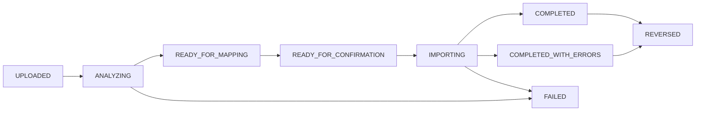

# SumUp 文件导入规范

## 范围

当前版本只导入用户从 SumUp 导出的文件，不调用 SumUp API，也不实现 Checkout、在线收款或刷卡机控制。支持：

- `.csv`
- `.xls`
- `.xlsx`

拒绝 PDF、图片、可执行文件、包含宏的文件和无法识别的内容。默认上限为 20 MB，由 `IMPORT_MAX_FILE_SIZE`（HTTP）和 `IMPORT_MAX_BYTES`（业务层）共同限制。CSV 与 XLSX 采用流式读取；XLSX 使用临时磁盘和 SAX 事件解析，不构造完整工作簿。旧版 XLS 默认最大 5 MB（`IMPORT_XLS_MAX_BYTES`）。所有格式默认最多 20,000 个数据行（`IMPORT_MAX_ROWS`），以适配 Railway 512 MB 实例。测试使用合成文件，不依赖真实交易数据。

上传、分析、预览都不会修改订单或交易。新上传必须先选择当前 Tenant 的启用展会，批次保存展会 ID 和名称快照。用户必须在预览影响后明确确认，后端才执行正式导入；包括正式导入和撤销在内的整个流程都不会修改库存。

## 支持的数据粒度

导入向导自动识别，无法可靠判断时要求用户选择：

| 类型 | 每行含义 | 订单/交易 | 库存影响 | 主销售报表 |
| --- | --- | --- | --- | --- |
| `TRANSACTION_HISTORY` | 一笔支付、退款、手续费等交易 | 创建/更新 `external_transactions`；成功支付可建未分配订单 | 无 | 逐笔交易或其关联订单只计一次 |
| `ORDER_HISTORY` | Ticket/Order 的一个商品行 | 按外部订单号聚合订单与明细 | 无 | 计算聚合后的订单一次 |
| `PRODUCT_SALES` | 某周期商品销售汇总 | 写 `imported_sales_summaries`，不伪造顾客订单 | 无 | 默认只用于对账，不与逐笔销售相加 |
| `ACCOUNTING_REPORT` | 日期/支付方式/税率汇总 | 写 `imported_accounting_summaries` | 无 | 只用于对账，不进入主销售额 |
| `UNKNOWN` | 不能可靠识别 | 不允许确认 | 无 | 无 |

交易级文件没有商品明细时，系统可以创建 `source=SUMUP_IMPORT`、`allocationStatus=UNALLOCATED` 的订单。它可以进入财务销售额，但不能进入具体商品销量。任何导入类型都不能扣减商品库存。

## 工作流与状态



`ImportRow.processingStatus` 使用 `PENDING`、`VALID`、`IMPORTED`、`UPDATED`、`DUPLICATE`、`SKIPPED`、`ERROR`。批次计数必须能由行状态和已写业务记录重新计算。

### 1. 上传

1. 从当前认证上下文取得 Tenant，并校验请求中的 `eventId` 属于该 Tenant 且已启用；请求不能指定其他 Tenant。
2. 校验扩展名、MIME、文件签名和大小；文件名只作为显示 metadata，不能影响 object key。
3. 流式计算文件字节的 SHA-256 checksum，同时写入 Tenant 私有存储。
4. 以 `(tenant_id, SUMUP, checksum)` 检查重复。相同内容即使改名也返回 `DUPLICATE_IMPORT_FILE`，并提供既有批次 ID。
5. 创建带展会快照的 `UPLOADED` ImportBatch。处理中且缺少展会的历史批次可通过受状态限制的设置展会接口补齐。

### 2. 分析

- CSV 检测 UTF-8、UTF-8 BOM 和 Windows-1252；分隔符检测逗号、分号、Tab。
- 识别表头所在行，忽略空行和明确的合计行。
- 数字解析支持 `1234.56`、`1 234,56`、`1.234,56`，但含糊值必须进入校验错误，不能猜测。
- 日期和时间根据列格式及 Tenant 时区解析，标准化为 UTC；无法解析或夏令时歧义必须提示。
- XLS 使用 Apache POI 读取；XLSX 使用事件/流式读取，避免把整个 workbook 驻留内存。
- 英法表头通过规范化词典映射，不能依赖列序号。
- 每 200 行批量写 `import_rows`，并清理 JPA 持久化上下文；保存 `normalized_data`、已清理的 `sanitized_raw_data` 和结构化 `validation_errors`。

每次重新分析增加 `analysis_version`。后续列映射和确认都必须携带用户看到的版本；版本不匹配返回冲突，防止确认过期预览。

### 3. 列映射

自动映射覆盖但不限于：

| 规范字段 | 英文示例 | 法文示例 |
| --- | --- | --- |
| 交易 ID/代码 | Transaction ID, Transaction Code | ID transaction, Code transaction |
| 日期/时间 | Date, Time | Date, Heure |
| 状态/类型 | Status, Type | Statut, Type |
| 金额/币种 | Amount, Currency | Montant, Devise |
| 手续费/净额 | Fee, Net Amount | Frais, Montant net |
| 商品/引用 | Product, Product Name, Reference, SKU | Produit, Référence |
| 数量/单价 | Quantity, Unit Price | Quantité, Prix unitaire |
| 折扣 | Discount | Réductions |
| 含税/未税收入 | Gross Revenue, Net Revenue | CA TTC, CA HT |
| 税 | VAT, Tax | Montant TVA, TVA |
| 支付方式 | Payment Method | Mode de paiement |
| 商户/位置 | Merchant, Employee, Location | Commerçant, Employé, Emplacement |

表头规范化包括 Unicode NFKC、去首尾空白、合并连续空白、Locale-independent 小写和去除无语义标点；保留重音字母参与词典匹配。用户可修改自动映射，必需字段未满足时保持 `READY_FOR_MAPPING` 并返回 `IMPORT_MAPPING_REQUIRED`。

### 4. 预览与验证

预览返回前若干行的原始显示值、标准化值、识别类型和行错误，并给出：

- 预计新增、状态更新、重复、跳过和错误数量；
- 需要商品映射的数量；
- 将创建订单还是仅创建财务记录；
- 每种币种的金额，不能跨币种合计；
- 未分配金额以及超过容差的分配。

只有 `READY_FOR_CONFIRMATION` 才接受确认。确认请求携带 `analysisVersion`、最终商品映射和是否记住映射等用户决策，不提供任何库存选项。

### 5. 商品映射

匹配顺序固定为：

1. 当前 Tenant 已保存的 `external_product_mappings`；
2. 外部 Reference/SKU 与当前 Tenant 的内部 SKU 精确匹配；
3. 规范化商品名称与内部商品名精确匹配；
4. 当前用户在向导中手动选择；
5. 保持未分配。

名称规范化使用 Unicode NFKC、trim、连续空白折叠和 Locale-independent 小写；不做模糊自动确定。近似结果只能作为建议，必须由用户确认。映射键包含 Tenant 和 provider，因此用户 A 的映射不能影响用户 B。

选择“记住映射”并保存商品映射时会立即写入 Tenant 范围的长期映射；取消后续导入不会自动删除该映射。只有用户明确勾选记住时才持久化。

### 6. 正式导入

- ImportBatch 通过条件更新从 `READY_FOR_CONFIRMATION` 进入 `IMPORTING`，防止两个确认任务并发执行。
- 分析和重映射按 `IMPORT_BATCH_SIZE=200` 分批写入；正式确认在一个数据库事务中完成，以保证订单、交易和行状态原子一致。为避免长事务和内存失控，单批次硬性限制为 20,000 行。
- 行状态、销售记录和批次进度在对应事务中一起提交。
- 新生成订单固定写 `sales_channel=EXHIBITION`、批次 `event_id/event_name` 和 `payment_method=SUMUP`；SumUp 是支付方式，不是新数据的销售渠道。
- 系统级中断会回滚整个正式确认事务；用户可以安全重试整批确认，唯一约束和幂等引用防止重复订单或销售额。当前版本不在单个批次内部断点续跑。
- 最终状态按结果设置 `COMPLETED` 或 `COMPLETED_WITH_ERRORS`；系统级失败使用 `FAILED` 并保留可诊断错误。

## 去重规则

### 文件去重

checksum 是原始文件字节的 SHA-256。唯一范围：

```text
tenantId + sourceProvider + fileChecksum
```

文件名、上传时间和 object key 不参与 checksum。不同 Tenant 可以上传相同文件；同一 Tenant 不能通过改文件名重复导入。

### 交易 ID 去重

存在稳定 `providerTransactionId` 时优先使用：

```text
tenantId + provider + providerTransactionId
```

同一交易再次出现：

- 内容/状态相同 → `DUPLICATE`，不重复写订单；
- 合法状态推进（如 SUCCESSFUL → REFUNDED）→ 更新原交易并幂等执行退款；
- 冲突的不可逆变化 → 行错误/人工处理，不能覆盖历史。

### Fingerprint

缺少稳定交易 ID 时生成确定性 fingerprint。参与字段固定为：

```text
tenantId
provider
occurredAt (UTC ISO-8601)
amount (无分组符的规范十进制)
currency (uppercase ISO 4217)
transactionType (uppercase canonical enum)
normalizedDescription
normalizedMerchantReference
```

文本使用 Unicode NFKC、trim、连续空白折叠和 Locale-independent 小写；空值编码为空字符串。字段按上述固定顺序以长度安全的规范 JSON 或等价明确分隔格式编码为 UTF-8，再计算 SHA-256 十六进制。不能使用展示语言、文件名、行号或本地时区字符串。

数据库唯一范围为 `(tenant_id, provider, fingerprint)`。算法或规范化规则变化需要提升 fingerprint 版本并提供兼容迁移，不能悄悄改变历史指纹。

## 订单与商品映射

### 交易级数据

- 创建/更新 ExternalTransaction。
- 成功交易没有商品明细时，可创建未分配 SumUp 订单；`unallocatedAmount=totalAmount`。
- 不虚构商品、不进入商品排行。
- 后续手动分配时校验商品金额与交易金额。默认允许最多 0.50 个订单币种单位的小费/服务费/舍入差额，并明确保存 `unallocatedAmount`；超过容差保持 `PARTIALLY_ALLOCATED`。

### 订单级数据

- 同一外部订单号的多行聚合为一张订单，每行转为订单明细。
- 商品映射完整时标记为已分配；未映射商品保留外部名称并标记为未分配。
- 订单明细只用于销售分析，确认导入时不检查或改变现有库存。
- 重复确认由导入行状态、外部交易幂等键和唯一约束共同阻止。

### 商品销售汇总

- 保存为 `imported_sales_summaries`，只用于销售对账，不伪造订单。
- 商品映射可用于识别销量，但汇总导入不能创建库存流水。
- 如需根据盘点或销售汇总调整库存，用户必须在库存页面单独操作并填写原因。

### 退款与状态更新

- 有订单项和退款数量时，更新尚未退款的对应数量并记录退款明细。
- 只有退款金额、没有商品数量时，只更新财务状态和退款金额。
- 两种退款都不改变库存；重复退款行按 provider ID/fingerprint 和累计退款状态幂等处理。

## 报表去重

报表必须通过集中 `ReportSourcePolicy` 决定来源：

1. 已关联手动订单的 SumUp 交易只计算订单。
2. SumUp 交易生成的订单只计算订单一次。
3. 未分配交易可进入财务销售额，但不进入商品销量。
4. 商品销售汇总默认只用于对账，不与逐笔订单/交易相加。
5. 会计汇总只用于对账，不进入主销售额。
6. 所有结果按币种分组，不执行隐式汇率换算。

导入和报表测试必须覆盖同时存在手动订单、关联交易、SumUp 生成订单和汇总文件的场景，并证明没有重复计算。

## 撤销

只有 `COMPLETED` 或 `COMPLETED_WITH_ERRORS` 批次可以撤销：

1. 锁定批次并确认未撤销、没有另一个撤销任务。
2. 预检查该批次产生的订单/交易是否在导入后被人工修改或关联其他数据。
3. 发现任何冲突时，整批自动撤销停止并返回人工处理清单；不能部分撤销后才报错。
4. 只失效由该批次创建且之后未被修改的订单/外部交易；ImportBatch 和 ImportRow 永久保留。
5. 不创建反向库存流水，也不修改当前库存。
6. 标记批次 `REVERSED`、记录操作人和时间，并写 AuditLog。

重复撤销返回 `IMPORT_ALREADY_REVERSED`；存在冲突返回 `IMPORT_CANNOT_BE_REVERSED`。撤销失败必须回滚整个撤销事务。

## 错误处理与恢复

- 行级问题写入结构化 `validation_errors`，批次可以 `COMPLETED_WITH_ERRORS`；系统/存储/数据库级故障使批次 `FAILED`。
- 错误 CSV 只包含定位和修复需要的已清理字段，下载前再次校验当前 Tenant。
- 任务重启后根据批次和行状态继续；不能仅依赖进程内队列保存进度。
- 同一外部订单作为最小原子单元；批量大小不能破坏订单原子性。
- 上传成功但分析失败的原文件保留供审计/重试；按数据保留策略清理时同时更新 `stored_files` 审计状态。

## 敏感数据清理

进入 `sanitized_raw_data`、`external_transactions.raw_data`、错误 CSV、日志或 AuditLog 前：

- 删除 CVV/CVC、完整 PAN、磁道数据、Access Token、API Key 和密码字段；
- 卡信息只保留 provider 已遮罩值或最多必要的末四位，不能自行保存完整值后再展示遮罩；
- 对字段名大小写、法文/英文同义词和嵌套对象执行递归 denylist 清理；
- 日志不打印整行原始数据，只记录 batchId、rowNumber、稳定错误 code 和 traceId；
- 原始上传文件保持私有，访问使用 Tenant 授权后的短期 URL，并按明确保留策略删除。

## API

```text
POST /api/v1/imports/sumup/upload?eventId={salesEventId}
GET  /api/v1/imports/sumup/{batchId}
PUT  /api/v1/imports/sumup/{batchId}/event
POST /api/v1/imports/sumup/{batchId}/analyze
PUT  /api/v1/imports/sumup/{batchId}/column-mapping
GET  /api/v1/imports/sumup/{batchId}/preview
PUT  /api/v1/imports/sumup/{batchId}/product-mappings
POST /api/v1/imports/sumup/{batchId}/confirm
GET  /api/v1/imports/sumup/{batchId}/rows
GET  /api/v1/imports/sumup/{batchId}/errors/export
POST /api/v1/imports/sumup/{batchId}/reverse
```

所有 `batchId` 查询从认证上下文附加 Tenant 条件。ADMIN 全局查看使用独立管理员 API，并记录跨 Tenant 审计。

## 合成测试文件

`backend/src/test/resources/sumup/` 应覆盖：UTF-8、BOM、Windows-1252、逗号/分号/Tab、英法表头、点/逗号小数、XLS/XLSX、空行、合计行、缺字段、未知格式、超限文件、重复 checksum、重复交易 ID、fingerprint、状态更新、全额/部分退款、自动/手动/失败商品映射、导入全程零库存影响、撤销和跨 Tenant 相同交易号。

## 未来 SumUp API 扩展点

文件导入和未来同步都应产生相同的规范外部交易模型，并复用去重、映射、订单和报表策略。边界接口可以表达为 `ExternalSalesProvider`，当前只有文件 provider；未来 API provider 负责拉取/分页/游标和签名验证，但不能绕过：

- Tenant 认证和 provider credential 隔离；
- 相同 provider ID/fingerprint 规则；
- 预览或明确配置的自动确认策略；
- 订单与库存解耦边界；
- 敏感字段清理和 AuditLog。

当前版本不创建没有行为的 `SumUpApiProvider` 空壳，也不保存未来 API 密钥字段。
